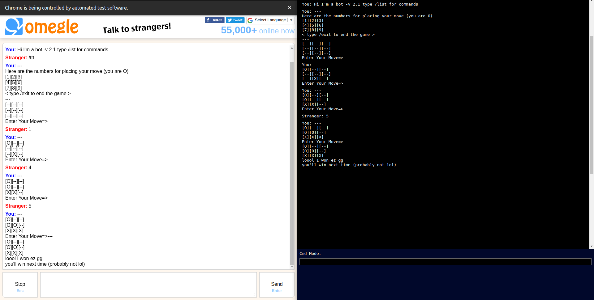
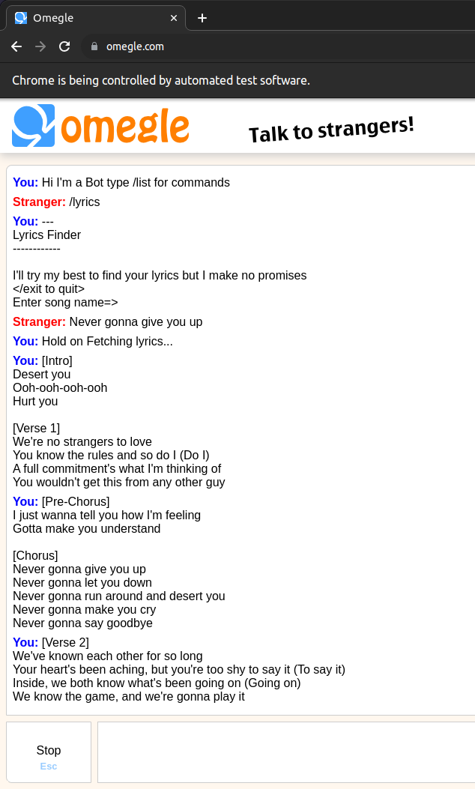

# Omegle-Selenium-Bot

An old prototype project made with Selenium to play tic tac toe with strangers

What can this bot do?

1. Play Tic Tac Toe
2. Play Rock Papers Scissors
3. Ask Riddles
4. Tell Jokes
5. Find Lyrics for songs
6. Take Feedbacks

Make sure to run `npm run preinstall` instead of `npm install` 

To start the server run: `npm run start` (make sure captcha is solved first) 
To start the bot go to `localhost:3000`  
To change any settings go to file `_settings/settings.json`

